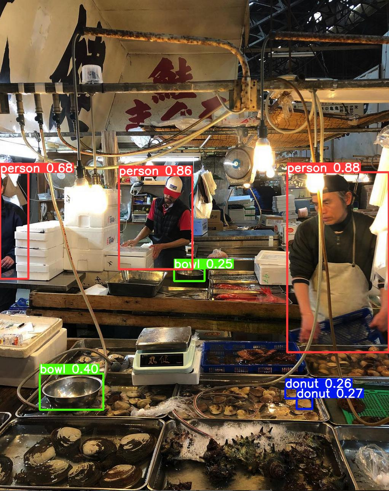

Object Detection API and webapp that uses [yolov5](https://github.com/ultralytics/yolov5) pretrained model.

YOLOv5 🚀 is a family of object detection architectures and models pretrained on the COCO dataset, and represents Ultralytics open-source research into future vision AI methods, incorporating lessons learned and best practices evolved over thousands of hours of research and development. 



# Steps
```bash
$ git clone https://github.com/JulianLopezB/ObjectDetectionAPI.git
$ cd ObjectDetectionAPI
$ pip install virtualenv
$ virtualenv objectdetectionapi
$ source objectdetectionapi/bin/activate
$ pip install -r requirements.txt
$ python webapp.py
```

then go to your local server


# To Do:
- [x] object detection in images (jpg, jpeg, png)
- [ ] object detection in videos (mp4, avi, mkv)
- [ ] static/tmp folder creation in case it doesn't exists
- [ ] add Dockerfile
- [ ] create dropdown in webapp that allows choosing different models
